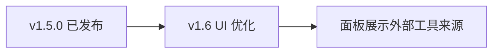

# 开发指南

**v1.5.0**

## 文档

| 文件 | 说明 |
|------|------|
| [README.md](./README.md) | 插件功能、安装、手动 MCP 配置 |
| [README.EN.md](./README.EN.md) | 英文 README |
| [FEATURE_GUIDE_CN.md](./FEATURE_GUIDE_CN.md) | MCP 工具说明 |

---

## 快速开始

```bash
# 1. 开发仓库：一次性配置
cp local.env.json.example local.env.json   # 填写 cocosProjectPath

# 2. 发布到 Cocos 工程
npm install && npm run publish

# 3. Creator：打开工程 → 扩展面板 → 启动服务器

# 4. 写入 AI 客户端 MCP 配置
cd <Cocos工程>/extensions/cocos-mcp-server && npm run deploy-mcp
# 或在开发仓库根目录：npm run deploy-mcp
```

然后重启 Cursor / Claude Code / Codex。

---

## 流程说明

```
开发仓库 ──publish──► Cocos工程/extensions/cocos-mcp-server
                              │
                    Creator 面板「启动服务器」
                              │
                    http://127.0.0.1:28473/mcp
                              │
              deploy-mcp ──► 工程根 .cursor / .mcp.json / .codex
                              │
                         AI 客户端连接
```

- `deploy-mcp` **只写**客户端配置，**不会**在 Creator 里启动 HTTP 服务。
- **不需要**改 Cocos 工程根目录的 `package.json`。

---

## 配置

### 开发仓库：`local.env.json`（必配，不提交）

```bash
cp local.env.json.example local.env.json
```

```json
{
  "cocosProjectPath": "/path/to/your/cocos-project",
  "extensionName": "cocos-mcp-server",
  "mcpServerName": "cocos-creator"
}
```

| 字段 | 说明 |
|------|------|
| `cocosProjectPath` | 本机 Cocos 工程绝对路径（`publish` / 开发仓库内 `deploy-mcp` 需要） |
| `extensionName` | 默认 `cocos-mcp-server` |
| `mcpServerName` | 写入各 AI 客户端的名称，默认 `cocos-creator` |

已加入 `.gitignore`，勿提交公共仓库。

### 身份关键字（仅本地，禁止进入 Git）

| 文件 | 说明 |
|------|------|
| `.cursor/identity-keywords.local.txt` | 禁用词列表，每行一个（已 gitignore） |
| `.cursor/rules/no-identity-keywords.local.mdc` | Cursor 规则（已 gitignore，正文不含具体词表） |

提交前执行：

```bash
npm run check:identity
```

默认检查 **已暂存** 文件；无暂存时扫描仓库内可提交类型文件（跳过 `.cursor/`、`node_modules`）。

### Cocos 工程：`local.env.json`（可选）

扩展已在 `extensions/cocos-mcp-server` 时，`deploy-mcp` **自动识别**工程根目录，一般不必再配 `cocosProjectPath`。

仅需覆盖名称等时，可在**工程根目录**放置（参考 `local.env.project.example.json`）：

```json
{
  "mcpServerName": "cocos-creator"
}
```

### 端口

在 `package.json` 中配置 `"mcpDefaultPort": 28473`，**不要**写在 `local.env.json` 里。

Creator 面板改过端口并保存后，须重新 `deploy-mcp`，客户端 URL 才会一致。端口优先读工程 `settings/mcp-server.json`。

---

## 命令

| 命令 | 在哪里执行 | 作用 |
|------|------------|------|
| `npm install` | 开发仓库 | 安装依赖 |
| `npm run build` | 开发仓库 | 编译到 `dist/` |
| `npm run watch` | 开发仓库 | 监听编译 |
| `npm run publish` | 开发仓库 | `build` + 同步到 Cocos 扩展目录 |
| `npm run deploy-mcp` | 开发仓库 **或** `extensions/cocos-mcp-server` | 写入 AI 客户端 MCP 配置 |
| `npm run test:registry` | 开发仓库 | 外部工具注册表单元测试（无需 Creator） |

---

## `npm run publish`

- **目标**：`{cocosProjectPath}/extensions/{extensionName}`
- **行为**：先清空目标扩展目录，再全量拷贝
- **发布前**：在本仓库执行 `npm install`（会连同 `node_modules` 一起同步）

**不会拷贝**：`.git`、`.cursor`、`.DS_Store`、`local.env.json`、`local.env.json.example`、`local.env.project.example.json`、`DEV.md`

**会拷贝**：`dist/`、`source/`、`scripts/`、`node_modules/` 等运行所需内容

---

## `npm run deploy-mcp`

写入 **Cocos 工程根目录**：

| 客户端 | 文件 |
|--------|------|
| Cursor | `.cursor/mcp.json` |
| Claude Code | `.mcp.json` |
| Codex | `.codex/config.toml` |

- **URL**：`http://127.0.0.1:{port}/mcp`
- **Codex**：写入 `experimental_use_rmcp_client = true`；名称含 `-` 时使用 `[mcp_servers."cocos-creator"]`
- **Codex**：工程须被信任后才会加载项目级 `.codex/config.toml`

---

## 检查清单

- [ ] `local.env.json` 已配置（开发仓库）
- [ ] `npm install && npm run build && npm run publish`
- [ ] Creator 启用扩展并**启动服务器**
- [ ] `deploy-mcp` 后重启 AI 客户端
- [ ] `curl http://127.0.0.1:28473/health` 有响应（端口以实际为准）
- [ ] `npm run check:identity` 通过
- [ ] 提交时勿包含 `local.env.json` 及 `.cursor/` 下本地文件

---

## 常见问题

**AI 连不上**

1. Creator 是否打开工程并在面板**启动服务器**？
2. 是否只跑了 `deploy-mcp` 却没在 Creator 里起服务？
3. 客户端端口与 Creator 面板是否一致？

**Codex 无 MCP**

- 重新 `deploy-mcp`，确认 `.codex/config.toml` 格式正确后重启 Codex

**扩展加载失败**

- 在 `extensions/cocos-mcp-server` 执行 `npm install`

---

## 第三方扩展接入

其他 Cocos 扩展可在运行时向本插件注册 MCP 工具，无需改 `cocos-mcp-server` 源码。

### 消息（`package.json` → `contributions.messages`）

| Message | 方法 | 说明 |
|---------|------|------|
| `mcp-register-tools` | `registerExternalTools` | 注册或覆盖工具 |
| `mcp-unregister-tools` | `unregisterExternalTools` | 按 `providerId` 注销 |
| `mcp-list-external-tools` | `listExternalTools` | 查询注册表 |

### 注册示例

```ts
Editor.Message.request('cocos-mcp-server', 'mcp-register-tools', {
  providerId: 'my-game-tools',      // 建议与扩展 name 一致
  invokeMessage: 'my-mcp-invoke',     // 本扩展 contributions.messages 中的 message
  tools: [
    {
      name: 'hello',
      description: '示例工具',
      inputSchema: { type: 'object', properties: { name: { type: 'string' } } },
    },
  ],
});
```

提供方在 `invokeMessage` 对应 method 中处理 `{ tool, args }`，返回 `{ success, data?, error? }`（同内置 `ToolResponse`）。

### 工具命名

- AI 可见全名：`{namespace}_{toolName}`，默认 `namespace === providerId`。
- `namespace` 不得与内置 category（`scene`、`node` 等）冲突。
- 同一 `providerId` 再次注册会**覆盖**旧工具列表。

### 示例扩展

将 [examples/mcp-provider-demo](./examples/mcp-provider-demo) 复制到工程的 `extensions/`，与 `cocos-mcp-server` 一并启用。注册后可用 MCP 调用 `mcp-provider-demo_hello`。

### 测试

```bash
npm run test:registry
```

---

## 版本说明

维护本仓库版本号与更新日志时，须遵循项目 skill：**[.cursor/skills/cocos-mcp-versioning/SKILL.md](.cursor/skills/cocos-mcp-versioning/SKILL.md)**（SemVer + Keep a Changelog + 下文分工）。

文档分工：

| 文档 | 内容 |
|------|------|
| [README.md § 更新日志](./README.md#更新日志) | **已发布**版本全文（v1.5.0、v1.4.x…及 Cocos 商城说明） |
| 下文 [§ 版本规划](#版本规划) | **未发布**功能草案（当前仅 v1.6） |

**本仓库 Git 当前**：v1.5.0（`package.json` 的 `version` 字段）。

> **版本号勿混用**：README 里「商城 v1.5.0（2024-07）」是 Cocos 商店渠道大版本；本仓库 **Git v1.5.0** 为扩展注册 MCP 工具，二者无关。

---

## 版本规划

### 总览



| 版本 | 主题 | 状态 |
|------|------|------|
| **v1.5.0** | 外部扩展注册 MCP 工具 | 已发布（见 [§ 第三方扩展接入](#第三方扩展接入)） |
| **v1.6.0** | Creator 面板 UI 优化（含外部工具展示） | 规划中 |

### v1.6.0 — UI 优化

**目标**：面板更易用；清晰区分内置 / 外部工具（依赖 v1.5）。

| P0 | P1 | P2 |
|----|----|----|
| 运行状态、启停 loading | 工具搜索 / 分类全选 | 外部工具按 `providerId` 分组 |
| 端口校验与保存反馈 | 启用数统计 | 错误提示、主题间距 |

**技术项**：拆分 `panels/default/index.ts`；订阅 `mcp-tools-changed` 减少轮询。

**English (planned)**：v1.6 — panel UX for built-in vs external tools. Git v1.5.0 (external registration) is shipped; unrelated to Cocos Store v1.5.0 in README.
