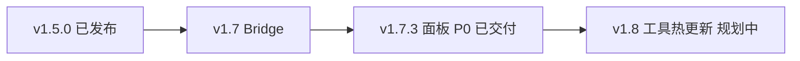

# 开发指南

**v1.7.7**

## 文档

| 文件 | 说明 |
|------|------|
| [README.md](./README.md) | 插件功能、安装、手动 MCP 配置 |
| [README.EN.md](./README.EN.md) | 英文 README |
| [MCP_EXTERNAL_TOOL_REGISTRATION.md](./MCP_EXTERNAL_TOOL_REGISTRATION.md) | **外部扩展注册 MCP 工具**（AI / 第三方集成） |
| [FEATURE_GUIDE_CN.md](./FEATURE_GUIDE_CN.md) | MCP 工具说明 |
| 下文 [§ 架构：在线能力提供者](#架构在线能力提供者) | v1.7 已实现：Bridge + ToolRegistry |
| 下文 [§ 版本规划](#版本规划) | v1.8 未发布草案；面板 P0 已于 v1.7.3 交付 |

---

## 快速开始

```bash
# 1. 开发仓库：一次性配置
cp local.env.json.example local.env.json   # 填写 cocosProjectPath

# 2. 发布到 Cocos 工程
npm install && npm run publish

# 3. Creator：打开工程 → 扩展面板 → 启动服务器

# 4. 写入 AI 客户端 MCP 配置
cd <Cocos工程>/extensions/cocos-mcp-server && npm run deploy-mcp
# 或在开发仓库根目录：npm run deploy-mcp
```

然后重启 Cursor / Claude Code / Codex。

---

## 流程说明

```
开发仓库 ──publish──► Cocos工程/extensions/cocos-mcp-server
                              │
                    Creator 面板「启动服务器」
                              │
                    http://127.0.0.1:28473/mcp
                              │
              deploy-mcp ──► 工程根 .cursor / .mcp.json / .codex
                              │
                         AI 客户端连接
```

- `deploy-mcp` **只写**客户端配置，**不会**在 Creator 里启动 HTTP 服务。
- **不需要**改 Cocos 工程根目录的 `package.json`。

---

## 配置

### 开发仓库：`local.env.json`（必配，不提交）

```bash
cp local.env.json.example local.env.json
```

```json
{
  "cocosProjectPath": "/path/to/your/cocos-project",
  "extensionName": "cocos-mcp-server",
  "mcpServerName": "cocos-creator"
}
```

| 字段 | 说明 |
|------|------|
| `cocosProjectPath` | 本机 Cocos 工程绝对路径（`publish` / 开发仓库内 `deploy-mcp` 需要） |
| `extensionName` | 默认 `cocos-mcp-server` |
| `mcpServerName` | 写入各 AI 客户端的名称，默认 `cocos-creator` |

已加入 `.gitignore`，勿提交公共仓库。

### 身份关键字（仅本地，禁止进入 Git）

| 文件 | 说明 |
|------|------|
| `.cursor/identity-keywords.local.txt` | 禁用词列表，每行一个（已 gitignore） |
| `.cursor/rules/no-identity-keywords.local.mdc` | Cursor 规则（已 gitignore，正文不含具体词表） |

提交前执行：

```bash
npm run check:identity
```

默认检查 **已暂存** 文件；无暂存时扫描仓库内可提交类型文件（跳过 `.cursor/`、`node_modules`）。

### Cocos 工程：`local.env.json`（可选）

扩展已在 `extensions/cocos-mcp-server` 时，`deploy-mcp` **自动识别**工程根目录，一般不必再配 `cocosProjectPath`。

仅需覆盖名称等时，可在**工程根目录**放置（参考 `local.env.project.example.json`）：

```json
{
  "mcpServerName": "cocos-creator"
}
```

### 端口

在 `package.json` 中配置 `"mcpDefaultPort": 28473`，**不要**写在 `local.env.json` 里。

MCP 服务器与工具管理器配置保存在 **本机用户目录**（Electron `userData`，与 Cocos Creator 一致），不在工程 `settings/` 内：

| 文件 | 说明 |
|------|------|
| `.cocos-mcp-server-mcp-settings.json` | 端口、autoStart、allowedOrigins 等 |
| `.cocos-mcp-server-tool-manager.json` | 工具启用配置槽位 |

macOS 典型路径：`~/Library/Application Support/CocosCreator/`。首次启动时会自动从旧版 `<工程>/settings/mcp-server.json` 与 `tool-manager.json` 迁移（若本地文件尚不存在）。

Creator 面板改过端口并保存后，须重新 `deploy-mcp`，客户端 URL 才会一致。`deploy-mcp` 读取上述本地 MCP 设置中的端口。

---

## 命令

| 命令 | 在哪里执行 | 作用 |
|------|------------|------|
| `npm install` | 开发仓库 | 安装依赖 |
| `npm run build` | 开发仓库 | 编译到 `dist/` |
| `npm run watch` | 开发仓库 | 监听编译 |
| `npm run publish` | 开发仓库 | `build` + 同步到 Cocos 扩展目录 |
| `npm run deploy-mcp` | 开发仓库 **或** `extensions/cocos-mcp-server` | 写入 AI 客户端 MCP 配置 |
| `npm run test:registry` | 开发仓库 | ToolRegistry / CapabilityManager 单元测试（无需 Creator） |
| `npm run test:tool-registry` | 开发仓库 | 同上（`test:registry` 别名） |

---

## `npm run publish`

- **目标**：`{cocosProjectPath}/extensions/{extensionName}`
- **行为**：先清空目标扩展目录，再全量拷贝
- **发布前**：在本仓库执行 `npm install`（会连同 `node_modules` 一起同步）

**不会拷贝**：`.git`、`.cursor`、`.DS_Store`、`local.env.json`、`local.env.json.example`、`local.env.project.example.json`、`DEV.md`

**会拷贝**：`dist/`、`source/`、`scripts/`、`node_modules/` 等运行所需内容

---

## `npm run deploy-mcp`

写入 **Cocos 工程根目录**：

| 客户端 | 文件 |
|--------|------|
| Cursor | `.cursor/mcp.json` |
| Claude Code | `.mcp.json` |
| Codex | `.codex/config.toml` |

- **URL**：`http://127.0.0.1:{port}/mcp`
- **Codex**：写入 `experimental_use_rmcp_client = true`；名称含 `-` 时使用 `[mcp_servers."cocos-creator"]`
- **Codex**：工程须被信任后才会加载项目级 `.codex/config.toml`

---

## 检查清单

- [ ] `local.env.json` 已配置（开发仓库）
- [ ] `npm install && npm run build && npm run publish`
- [ ] Creator 启用扩展并**启动服务器**
- [ ] `deploy-mcp` 后重启 AI 客户端
- [ ] `curl http://127.0.0.1:28473/health` 有响应（端口以实际为准）
- [ ] `npm run check:identity` 通过
- [ ] 提交时勿包含 `local.env.json` 及 `.cursor/` 下本地文件

---

## 常见问题

**AI 连不上**

1. Creator 是否打开工程并在面板**启动服务器**？
2. 是否只跑了 `deploy-mcp` 却没在 Creator 里起服务？
3. 客户端端口与 Creator 面板是否一致？

**Codex 无 MCP**

- 重新 `deploy-mcp`，确认 `.codex/config.toml` 格式正确后重启 Codex

**扩展加载失败**

- 在 `extensions/cocos-mcp-server` 执行 `npm install`

---

## 第三方扩展接入

其他 Cocos 扩展可在运行时向本插件注册 MCP 工具，无需改 `cocos-mcp-server` 源码。

> **完整指南（推荐 AI / 集成方阅读）**：[MCP_EXTERNAL_TOOL_REGISTRATION.md](./MCP_EXTERNAL_TOOL_REGISTRATION.md)  
> 含：Agent 步骤清单、Payload  schema、命名规则、ToolResponse 约定、现有能力映射模式、验证与常见错误。

### 消息（`package.json` → `contributions.messages`）

| Message | 方法 | 说明 |
|---------|------|------|
| `mcp-register-tools` | `registerExternalTools` | 注册或覆盖工具 |
| `mcp-unregister-tools` | `unregisterExternalTools` | 按 `providerId` 注销 |
| `mcp-list-external-tools` | `listExternalTools` | 查询注册表 |

### 注册示例

```ts
Editor.Message.request('cocos-mcp-server', 'mcp-register-tools', {
  providerId: 'my-game-tools',      // 建议与扩展 name 一致
  invokeMessage: 'my-mcp-invoke',     // 本扩展 contributions.messages 中的 message
  tools: [
    {
      name: 'hello',
      description: '示例工具',
      inputSchema: { type: 'object', properties: { name: { type: 'string' } } },
    },
  ],
});
```

提供方在 `invokeMessage` 对应 method 中处理 `{ tool, args }`，返回 `{ success, data?, error? }`（同内置 `ToolResponse`）。

### 工具命名

- AI 可见全名：`{namespace}_{toolName}`，默认 `namespace === providerId`。
- `namespace` 不得与内置 category（`scene`、`node` 等）冲突。
- 同一 `providerId` 再次注册会**覆盖**旧工具列表。

### 示例扩展

将 [examples/mcp-provider-demo](./examples/mcp-provider-demo) 复制到工程的 `extensions/`，与 `cocos-mcp-server` 一并启用。注册后可用 MCP 调用 `mcp-provider-demo_hello`。

### 测试

```bash
npm run test:registry
```

### 与 Capability Bridge 的关系（v1.7+）

v1.5 的 `mcp-register-tools` **继续可用**。注册请求由 `CapabilityManager.registerExternal` 处理，创建 `ExternalMessageAdapter` 并写入内存 `ToolRegistry`；`MCPServer` 仅代理 `tools/call`。详见 [§ 架构：在线能力提供者](#架构在线能力提供者)。

---

## 架构：在线能力提供者

**Online Capability Provider**（中文：在线能力提供者）是本仓库 v1.7 起的内部架构方向：**依托 Cocos 扩展体系**，不拆独立 MCP CLI 进程，不引入跨进程 WebSocket。

### 定位

| 角色 | 职责 |
|------|------|
| **Cocos 扩展** | 能力提供方（唯一事实源）；掌握当前项目、场景、扩展、Editor API |
| **MCP 协议层**（扩展内 `MCPServer`） | 对外暴露 MCP；`tools/list`、`tools/call`；**不内嵌** Cocos 业务逻辑 |
| **Capability Bridge**（扩展内） | 聚合内置与第三方 capability；执行工具；向 `ToolRegistry` 全量同步 |
| **ToolRegistry**（内存） | 运行时工具索引；重启即清空；按 `providerId` 全量替换 |

### 设计原则

1. **不持久化工具注册表** — 无 `registry.json`；每次扩展 `load` / HTTP 服务启动后由 Provider 全量上报。
2. **Cocos 插件是唯一事实源** — 有什么能力由 Bridge 决定；MCP 层只代理。
3. **全量同步优于增量 diff** — 能力变更时对同一 `providerId` 先移除旧 tools 再写入新列表。
4. **Provider 离线即工具下线** — 扩展 `unload` 或第三方 `mcp-unregister-tools` 后，对应 tools 从 `tools/list` 消失。

### 进程模型（明确不做的事）

```txt
✅ 采用
  AI Host ──HTTP MCP──► cocos-mcp-server 扩展（单进程）
                            ├─ MCPServer（协议网关）
                            ├─ ToolRegistry（内存）
                            └─ Capability Bridge ──► *Tools / 第三方扩展

❌ 不做（本仓库范围内）
  独立 MCP CLI 子进程（stdio 拉起、与 Editor 生命周期解耦）
  跨进程 WebSocket Provider 通道（除非未来明确需要「一个 MCP 聚合多个 Editor」）
```

部署方式不变：Creator 面板启动 HTTP 服务 → `deploy-mcp` 写客户端 URL → AI 连接 `http://127.0.0.1:{port}/mcp`。

### 架构图

```txt
AI Host（Cursor / Claude / Codex）
        │  MCP over HTTP
        ▼
┌─────────────────────────────────────────────┐
│  cocos-mcp-server 扩展（Cocos Creator 进程）   │
│                                             │
│  MCPServer          ToolRegistry（内存）    │
│      │                    ▲                 │
│      │ tools/call        │ 全量 sync        │
│      ▼                    │                 │
│  Capability Bridge ───────┘                 │
│      │                                      │
│      ├─ capabilities/scene   （tools.ts + index.ts）
│      ├─ capabilities/node    …共 14 个领域模块   │
│      └─ external adapters    （第三方 Editor.Message 注册）
│              │                              │
└──────────────┼──────────────────────────────┘
               ▼
        Cocos Editor API / 项目 assets / 场景
```

### 目标模块划分

| 路径 | 说明 |
|------|------|
| `source/main.ts` / `source/scene.ts` | Cocos 扩展入口（须保持根路径，对应 `package.json`） |
| `source/core/` | `constants.ts`、`settings.ts` |
| `source/mcp/server.ts` | MCP 协议网关（HTTP、`tools/list`、`tools/call`） |
| `source/registry/` | 内存 `ToolRegistry`、外部注册 payload 校验 |
| `source/bridge/` | `CapabilityManager`、内置注册表、内外适配器 |
| `source/capabilities/<领域>/` | `tools.ts`（实现）+ `index.ts`（capability 工厂） |
| `source/config/tool-manager.ts` | 面板工具启用配置（非执行层） |
| `source/panel/` | Creator 面板 UI（`default`、`tool-manager`） |

### 核心接口（草案）

```ts
interface CocosCapabilityPlugin {
  readonly providerId: string;   // 内置如 "cocos-builtin-scene"
  getTools(): ProviderToolDefinition[];
  callTool(name: string, args: unknown): Promise<ToolResponse>;
}

interface ProviderSession {
  providerId: string;
  projectRoot: string;
  cocosVersion?: string;
  tools: ProviderTool[];
  connectedAt: number;
}
```

内置工具对外名称**保持 v1.5 约定**：`{category}_{toolName}`（如 `scene_get_scene_hierarchy`）。`cocos.*` 点分命名留作未来 MAJOR 再议，避免破坏现有 AI 工作流。

### 调用流程

```txt
AI  tools/call("scene_get_scene_hierarchy", args)
  → MCPServer.executeToolCall
  → ToolRegistry.resolve(toolName) → { providerId, shortName }
  → CapabilityManager.callTool(providerId, shortName, args)
  → ScenePlugin.callTool → SceneTools.execute
  → ToolResponse 原路返回 → MCP JSON-RPC
```

### 能力变更与生命周期

| 事件 | 行为 |
|------|------|
| 扩展 `load` + HTTP 服务 `start` | Bridge 收集全部 plugin tools → `ToolRegistry.syncProvider` 全量写入 |
| 第三方 `mcp-register-tools` | 注册 external adapter → 全量 sync 该 `providerId` |
| 第三方 `mcp-unregister-tools` / 扩展 `unload` | `ToolRegistry.removeProvider` → 刷新 `tools/list` |
| MCP HTTP 服务 `stop` | registry 可保留至进程结束；下次 `start` 重新 sync |

### 与当前代码的对照

| 能力 | v1.5 现状 | v1.7 目标 |
|------|-----------|-----------|
| 外部扩展注册 | `ExternalToolRegistry` + `Editor.Message` | 迁入 `ToolRegistry` + external adapter |
| 内置工具 | `MCPServer` 直接 `new SceneTools()` | 经 Capability Bridge 代理 |
| 工具启用过滤 | `ToolManager` + `enabledTools` | 不变；过滤在 `setupTools` 层 |
| 持久化 | 无工具 registry 文件 | MCP / ToolManager 配置存于本机 userData（见 [§ 配置](#配置)） |

---

## 版本说明

维护本仓库版本号与更新日志时，须遵循项目 skill：**[.cursor/skills/cocos-mcp-versioning/SKILL.md](.cursor/skills/cocos-mcp-versioning/SKILL.md)**（SemVer + Keep a Changelog + 下文分工）。

文档分工：

| 文档 | 内容 |
|------|------|
| [README.md § 更新日志](./README.md#更新日志) | **已发布**版本全文（v1.5.0、v1.4.x…及 Cocos 商城说明） |
| 下文 [§ 版本规划](#版本规划) | **未发布**功能草案（当前仅 v1.8） |

**本仓库 Git 当前**：v1.7.7（`package.json` 的 `version` 字段）。

> **版本号勿混用**：README 里「商城 v1.5.0（2024-07）」是 Cocos 商店渠道大版本；本仓库 **Git v1.5.0** 为扩展注册 MCP 工具，二者无关。

---

## 版本规划

### 总览



| 版本 | 主题 | 状态 |
|------|------|------|
| **v1.5.0** | 外部扩展注册 MCP 工具 | 已发布（见 [§ 第三方扩展接入](#第三方扩展接入)） |
| **v1.7.0** | 在线能力提供者（进程内架构重构） | 已发布（见 [§ 架构：在线能力提供者](#架构在线能力提供者)） |
| **v1.7.1** | Registry/MCP 原子 sync 与 invoke 契约 | 已发布（见 README 更新日志） |
| **v1.7.2** | registry/面板/MCP 安全与契约修复 | 已发布（见 README 更新日志） |
| **v1.7.3** | 默认面板 UI（启停 loading、校验、内置/外部区分） | 已发布（见 README 更新日志） |
| **v1.7.4** | 工具启用语义与外部工具 enabled 同步 | 已发布（见 README 更新日志） |
| **v1.7.5** | Bug 修复与文档完善（12项修复） | 已发布（见 README 更新日志） |
| **v1.7.6** | 面板 UI 美化（主题适配、状态指示、计数徽章） | 已发布（见 README 更新日志） |
| **v1.7.7** | 配置持久化迁至本机 userData | 已发布（见 README 更新日志） |
| **v1.8.0** | `tools/list_changed` 与状态探针工具 | 规划中（可选） |

> 与 Cocos 商城「v1.5.0（2024-07）」无关；Git 版本以 `package.json` 为准。

### 面板 UI（历史规划代号 v1.6 → 已于 v1.7.3 交付 P0）

**目标**：面板更易用；清晰区分内置 / 外部工具（依赖 v1.5）。

| 优先级 | 项 | 状态 |
|--------|-----|------|
| P0 | 运行状态、启停 loading；端口校验与保存反馈 | ✅ v1.7.3 |
| P0 | 内置/外部分区、外部 provider 摘要；`mcp-tools-changed` 刷新 | ✅ v1.7.3 |
| P1 | 工具搜索 / 分类全选；启用数统计 | 未交付（后续 patch 或 v1.8 前） |
| P2 | 外部工具按 `providerId` 分组；错误提示、主题间距 | 未交付 |

> **版本号说明**：内部曾用「v1.6」指面板 UX 迭代；SemVer 上 P0 以 **v1.7.3** 发布，与 Git v1.6.x 无对应 tag。

### v1.8.0 — 工具热更新（可选）

**目标**：AI 客户端在工具列表变化时自动感知，无需重连。

| 项 | 内容 |
|----|------|
| 协议 | MCP `notifications/tools/list_changed`（依赖客户端 transport 能力） |
| 工具 | `server_status` 或新增探针：当前 `providerId`、工程路径、在线工具数 |
| 前置 | v1.7 `ToolRegistry` 在 sync/remove 时触发 notifier |

**English**：Shipped — v1.7.x Capability Bridge; v1.7.3 default panel P0. Planned — v1.8 tool hot-reload. Git releases unrelated to Cocos Store v1.5.0 in README.
