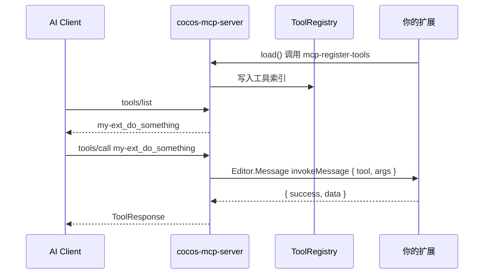

# 外部扩展 MCP 工具注册指南（AI / 开发者）

> **读者**：Cursor、Claude 等 AI 助手，以及需要将**现有 Cocos 扩展能力**暴露为 MCP 工具的开发者。  
> **目标**：在不修改 `cocos-mcp-server` 源码的前提下，把另一个扩展里的功能注册为 AI 可调用的 MCP 工具。  
> **前提**：工程已安装并启用 [cocos-mcp-server](./README.md) 扩展，MCP HTTP 服务已启动。

---

## 1. 30 秒理解



| 概念 | 说明 |
|------|------|
| **providerId** | 你的扩展唯一 ID，建议等于 `package.json` 的 `name` |
| **namespace** | MCP 工具名前缀，默认等于 `providerId` |
| **全名 fullName** | `{namespace}_{toolName}`，AI 在 `tools/call` 中使用 |
| **invokeMessage** | 你扩展里声明的消息名；MCP 调用时向该消息派发 `{ tool, args }` |

---

## 2. AI 工作流（给 Agent 的步骤清单）

当用户说「把这个插件的能力注册到 MCP」时，按顺序执行：

1. **读提供方扩展**：找到 `package.json` 的 `name`、已有 `contributions.messages` / `methods`、可暴露的业务函数。
2. **设计工具表**：每个 MCP 工具 = 一个 `name` + `description` + `inputSchema` + 映射到现有函数。
3. **改提供方 `package.json`**：新增 `invokeMessage` 对应的 `contributions.messages` 条目。
4. **实现 invoke 方法**：接收 `{ tool, args }`，按 `tool` 分发，返回 `ToolResponse`（见 §5）。
5. **在 `load()` 注册**：`Editor.Message.request('cocos-mcp-server', 'mcp-register-tools', payload)`。
6. **在 `unload()` 注销**：`mcp-unregister-tools` + 同一 `providerId`。
7. **验证**：`mcp-list-external-tools` → MCP `tools/list` → `tools/call` 试调用。

**不要**：

- 使用 `cocos-builtin-*` 作为 `providerId`（保留给内置能力）。
- 使用与内置 category 相同的 `namespace`（见 §4.3）。
- 在 `namespace` 或 `providerId` 中使用 `_`（Simple API 路径按第一个 `_` 切分，易歧义）。
- 修改 `cocos-mcp-server` 源码来加工具（应走本注册 API）。

---

## 3. 注册 API

### 3.1 消息一览

向扩展 **`cocos-mcp-server`** 发 `Editor.Message.request`：

| Message | 方法 | 参数 | 返回 |
|---------|------|------|------|
| `mcp-register-tools` | `registerExternalTools` | `RegisterExternalToolsPayload` | `RegisterResult` |
| `mcp-unregister-tools` | `unregisterExternalTools` | `{ providerId: string }` | `{ success, removed }` |
| `mcp-list-external-tools` | `listExternalTools` | 无 | `{ providers, tools }` |

### 3.2 `RegisterExternalToolsPayload`

```typescript
interface RegisterExternalToolsPayload {
    providerId: string;       // 必填，^[a-zA-Z][a-zA-Z0-9_-]*$
    namespace?: string;       // 可选，默认 providerId；不得与内置 category 冲突
    invokeMessage: string;    // 必填，本扩展 contributions.messages 中的 message 名
    tools: {
        name: string;         // 必填，^[a-zA-Z][a-zA-Z0-9_]*$，同 provider 内唯一
        description: string;  // 必填，给 AI 看的说明
        inputSchema: object;  // 必填，JSON Schema 风格（MCP tools/list 原样暴露）
    }[];
}
```

### 3.3 `RegisterResult`

```typescript
interface RegisterResult {
    success: boolean;
    error?: string;
    registeredToolNames?: string[];  // 成功时，如 ["my-ext_hello", "my-ext_run_pipeline"]
}
```

**行为说明**：

- 同一 `providerId` **再次注册 = 全量替换**旧工具列表（非增量 patch）。
- 注册失败时，**保留**该 provider 上一次成功的注册（不会半更新）。
- 注册成功后工具进入 `tools/list`；可在 Creator 面板「工具管理」中启用/禁用（禁用的工具无法 `tools/call`）。

---

## 4. 命名与校验规则

### 4.1 工具全名

```
fullName = namespace + "_" + tool.name
```

示例：`providerId = my-game-tools`，`name = export_config` → AI 调用 **`my-game-tools_export_config`**。

### 4.2 保留的 providerId

不得使用以 **`cocos-builtin-`** 开头的 `providerId`（内置 capability 专用）。

### 4.3 保留的 namespace（内置 category）

以下字符串**不能**作为 `namespace`（与内置工具冲突）：

```
scene, node, component, prefab, project, debug, preferences,
server, broadcast, sceneAdvanced, sceneView, referenceImage,
assetAdvanced, validation
```

### 4.4 inputSchema 建议

与 MCP / JSON Schema 一致，至少包含：

```json
{
  "type": "object",
  "properties": {
    "nodeUuid": { "type": "string", "description": "Target node UUID" }
  },
  "required": ["nodeUuid"]
}
```

字段 `description` 越具体，AI 越能正确填参。

---

## 5. 提供方扩展实现

### 5.1 `package.json` 片段

```json
{
  "name": "my-game-tools",
  "main": "./dist/main.js",
  "contributions": {
    "messages": {
      "my-game-mcp-invoke": {
        "methods": ["invokeMcpTool"]
      }
    }
  }
}
```

- `my-game-mcp-invoke` → 注册时的 **`invokeMessage`**。
- `invokeMcpTool` → 主进程 `exports.methods` 中的处理函数。

### 5.2 主进程 `main.ts` / `main.js`

```typescript
const MCP_SERVER = 'cocos-mcp-server';

/** MCP 调用入口：payload = { tool: string, args: object } */
async function invokeMcpTool(payload: { tool?: string; args?: Record<string, unknown> }) {
    const tool = payload?.tool;
    const args = payload?.args ?? {};

    switch (tool) {
        case 'hello':
            return {
                success: true,
                data: { message: `hello ${args.name ?? 'world'}` },
            };
        case 'run_pipeline':
            return await runPipeline(args as { pipelineId: string });
        default:
            return { success: false, error: `Unknown tool: ${tool}` };
    }
}

/** 将现有能力映射为 MCP 工具元数据 */
function getMcpToolDefinitions() {
    return [
        {
            name: 'hello',
            description: 'Return a greeting string',
            inputSchema: {
                type: 'object',
                properties: {
                    name: { type: 'string', description: 'Name to greet' },
                },
            },
        },
        {
            name: 'run_pipeline',
            description: 'Run a named editor pipeline',
            inputSchema: {
                type: 'object',
                properties: {
                    pipelineId: { type: 'string', description: 'Pipeline id' },
                },
                required: ['pipelineId'],
            },
        },
    ];
}

export const methods = { invokeMcpTool };

export function load() {
    Editor.Message.request(MCP_SERVER, 'mcp-register-tools', {
        providerId: 'my-game-tools',
        invokeMessage: 'my-game-mcp-invoke',
        tools: getMcpToolDefinitions(),
    }).then((result) => {
        if (result?.success) {
            console.log('[my-game-tools] MCP tools:', result.registeredToolNames);
        } else {
            console.error('[my-game-tools] MCP register failed:', result?.error);
        }
    });
}

export function unload() {
    Editor.Message.request(MCP_SERVER, 'mcp-unregister-tools', {
        providerId: 'my-game-tools',
    });
}
```

### 5.3 `ToolResponse` 约定

与内置工具相同：

```typescript
interface ToolResponse {
    success: boolean;
    data?: unknown;
    message?: string;
    error?: string;
    instruction?: string;   // 可选：提示 AI 下一步
    warning?: string;
}
```

| 情况 | 返回 |
|------|------|
| 成功 | `{ success: true, data: ... }` |
| 业务失败 | `{ success: false, error: "原因" }` |
| 抛错未捕获 | MCP 层包装为 `{ success: false, error: "External provider ... failed: ..." }` |

**注意**：`success` 必须是 **boolean**。返回 `{ success: "false" }` 会被视为非法。

若 handler 返回非对象（如字符串），会被规范化为 `{ success: true, data: "..." }`。

---

## 6. 把「现有插件能力」映射为 MCP 工具

### 6.1 一对一映射（最常见）

| 现有能力 | MCP tool.name | description 要点 |
|----------|---------------|------------------|
| `exportLevel(uuid)` | `export_level` | 说明 uuid 含义、返回值 |
| `batchRename(pattern)` | `batch_rename` | 说明 pattern 语法 |

在 `invokeMcpTool` 的 `switch (tool)` 中调用原函数即可。

### 6.2 多工具共用一个 invoke

**推荐**：一个 provider、一个 `invokeMessage`、多个 `tools[]` 条目，在 handler 内分发。  
**不推荐**：每个工具单独注册一个 provider（浪费且难管理）。

### 6.3 依赖 Editor API 的异步工具

```typescript
case 'query_assets':
    try {
        const list = await Editor.Message.request('asset-db', 'query-assets', args);
        return { success: true, data: list };
    } catch (e: any) {
        return { success: false, error: e.message };
    }
```

### 6.4 注册时机

| 时机 | 做法 |
|------|------|
| 扩展 `load()` | 标准做法（见示例） |
| 配置变更后 | 再次 `mcp-register-tools` 全量替换 |
| 扩展 `unload()` | 必须 `mcp-unregister-tools` |

若 `cocos-mcp-server` 晚于你的扩展加载，可在 `load()` 注册失败时 **延迟重试**（例如 2s 后再 `mcp-register-tools`）。

---

## 7. 验证

### 7.1 Creator 内

```javascript
// 查询已注册外部 provider
Editor.Message.request('cocos-mcp-server', 'mcp-list-external-tools');
```

面板：**扩展 → Cocos MCP Server → 工具管理**，外部工具 category 带「外部」标记。

### 7.2 MCP HTTP（默认端口见 package.json `mcpDefaultPort`，当前为 28473）

```bash
# 列表（需服务已启动）
curl -s http://127.0.0.1:28473/mcp -d '{"jsonrpc":"2.0","id":1,"method":"tools/list"}'

# 调用
curl -s http://127.0.0.1:28473/mcp -d '{
  "jsonrpc":"2.0","id":2,"method":"tools/call",
  "params":{"name":"my-game-tools_hello","arguments":{"name":"MCP"}}
}'
```

Simple API（可选）：

```bash
curl -s -X POST http://127.0.0.1:28473/api/my-game-tools/hello \
  -H "Content-Type: application/json" \
  -d '{"name":"MCP"}'
```

### 7.3 单元测试（注册表逻辑，无需 Creator）

```bash
npm run test:tool-registry
```

---

## 8. 常见错误

| error 片段 | 原因 | 处理 |
|------------|------|------|
| `reserved for built-in providers` | `providerId` 以 `cocos-builtin-` 开头 | 换成扩展名 |
| `conflicts with built-in category` | `namespace` 用了 `scene` 等 | 改用扩展名或自定义前缀 |
| `already registered` | 与其他 provider 的全名冲突 | 改 `namespace` 或 `tool.name` |
| `invalid tool name` | name 含 `-`、空格或以数字开头 | 仅用 `[a-zA-Z][a-zA-Z0-9_]*` |
| `Tool ... is disabled` | 面板中关闭了该工具 | 在工具管理启用 |
| Register 成功但 call 失败 | `invokeMessage` / method 名不匹配 | 核对 package.json messages 与 methods |

---

## 9. 完整最小示例

仓库内可运行示例：[examples/mcp-provider-demo](./examples/mcp-provider-demo)

1. 复制到 `<cocos-project>/extensions/mcp-provider-demo`
2. Creator 启用 `cocos-mcp-server` 与 `mcp-provider-demo`
3. 启动 MCP 服务
4. 调用 `mcp-provider-demo_hello`

---

## 10. 与内置工具的关系

- 内置工具（`scene_*`、`node_*` 等）由 `cocos-mcp-server` 的 Capability Bridge 注册，**不能**通过本 API 覆盖。
- 外部工具与内置工具在 `tools/list` 中**并列**出现；命名空间分离，互不影响。
- v1.7+ 架构说明见 [DEV.md § 架构：在线能力提供者](./DEV.md#架构在线能力提供者)。

---

## 11. 快速复制模板（AI 生成代码时用）

```json
{
  "providerId": "<extension-name>",
  "invokeMessage": "<extension-name>-mcp-invoke",
  "tools": [
    {
      "name": "<snake_case_tool>",
      "description": "<one line for AI>",
      "inputSchema": {
        "type": "object",
        "properties": {},
        "required": []
      }
    }
  ]
}
```

替换占位符 → 实现 `invokeMcpTool` → `load`/`unload` 注册注销 → §7 验证。

---

**相关文档**：[DEV.md § 第三方扩展接入](./DEV.md#第三方扩展接入) · [README 快速链接](./README.md) · [示例扩展](./examples/mcp-provider-demo)
